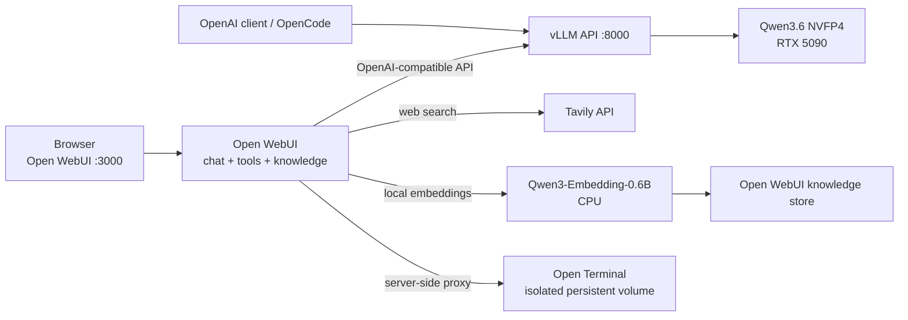

# Qwen3.6 NVFP4 vLLM Stack

This repository runs either of two Unsloth NVFP4 Qwen3.6 checkpoints on one
NVIDIA GPU and exposes them through vLLM's OpenAI-compatible API. The default
Docker Compose stack also provides an authenticated Open WebUI, Tavily web
search, CPU-based Qwen embeddings for RAG, and an isolated Open Terminal coding
workspace.

This project is tuned and measured on one NVIDIA RTX 5090 with 32 GB of
VRAM. It has no SLA or warranty. The wrapper is open source under the
[Apache License 2.0](LICENSE); contributions are welcome through the workflow in
[CONTRIBUTING.md](CONTRIBUTING.md).

## How it works



Only vLLM receives the NVIDIA device. Open WebUI runs the embedding model on
CPU, and Open Terminal has neither the host checkout nor the Docker socket
mounted. The terminal is nevertheless a shared command-execution environment;
grant access only to trusted users.

## Requirements

- NVIDIA driver 580 or newer; this host uses the open-kernel driver required
  for Blackwell.
- Docker Engine with the Compose plugin.
- NVIDIA Container Toolkit configured for Docker.
- Enough disk for the selected checkpoint, the approximately 1.2 GB embedding
  model, the Open Terminal image, and persistent caches.
- A Tavily API key for web search.

The pinned vLLM image uses CUDA 13. A driver that is too old can fail with
`Error 804: forward compatibility was attempted on non supported HW`. Verify
the base image and GPU runtime before starting the full stack:

```bash
docker run --rm --runtime nvidia --gpus all \
  vllm/vllm-openai:v0.25.1 nvidia-smi
```

## Supported platform

The measured settings and smoke tests target Linux x86_64, Docker Compose, and
one RTX 5090. Other recent NVIDIA GPUs may work, but context capacity and memory
settings must be measured again. macOS and Windows cannot run this CUDA stack
as configured.

## Install

Clone the repository and create the local configuration:

```bash
git clone https://github.com/spunkytensor/vllm-qwen-nvidia.git
cd vllm-qwen-nvidia
cp .env.example .env
```

Generate three independent secrets and paste them into `.env` as
`VLLM_API_KEY`, `WEBUI_SECRET_KEY`, and `OPEN_TERMINAL_API_KEY`:

```bash
openssl rand -hex 32
openssl rand -hex 32
openssl rand -hex 32
```

Add your `TAVILY_API_KEY`, download the selected generation model and the fixed
embedding model with the host Hugging Face CLI (installed directly or invoked
ephemerally through `uvx`), then start the complete stack:

```bash
./scripts/download-model.sh
./scripts/compose.sh up -d --build
./scripts/compose.sh logs -f vllm open-terminal open-webui
```

The stack never downloads model assets. `download-model.sh` reads
`MODEL_PRESET` from the environment or `.env`, defaults to
`Qwen3.6-35B-A3B`, and stores the generation checkpoint in
`${HF_CACHE_PATH:-$HOME/.cache/huggingface}`. It also provisions
`Qwen/Qwen3-Embedding-0.6B` in
`${EMBEDDING_CACHE_PATH:-$HOME/.cache/open-webui/embedding}`. Set `HF_TOKEN` in
the host shell when the Hugging Face CLI needs one; the token is not passed into
either service. The Compose wrapper detects the invoking host UID, verifies
both checkpoints, and mounts both caches read-only. vLLM and Open WebUI run in
Hugging Face offline mode and fail instead of downloading missing files.

Model initialization can take several minutes. Open WebUI waits for vLLM and
Open Terminal to become healthy, then becomes available at
<http://localhost:3000>. The first account created is the administrator;
subsequent accounts remain pending until approved.

The raw vLLM API remains available at <http://localhost:8000/v1> and requires
`VLLM_API_KEY` as a Bearer token. Compose passes that credential to Open WebUI
automatically. Both published services bind to loopback by default; do not
change the bind addresses without an appropriate firewall or authenticated TLS
reverse proxy.

## Configuration

The top-level `.env` is the operator interface. These are the primary settings:

| Variable | Default | Purpose |
|---|---:|---|
| `MODEL_PRESET` | `Qwen3.6-35B-A3B` | Select the complete validated vLLM profile. |
| `HOST_PORT` | `8000` | Publish the vLLM API on this host port. |
| `OPEN_WEBUI_PORT` | `3000` | Publish Open WebUI on this host port. |
| `VLLM_BIND_ADDRESS` | `127.0.0.1` | Host address on which to publish vLLM. |
| `OPEN_WEBUI_BIND_ADDRESS` | `127.0.0.1` | Host address on which to publish Open WebUI. |
| `VLLM_SHM_SIZE` | `8gb` | Size of vLLM's private shared-memory filesystem. |
| `VLLM_API_KEY` | none | Authenticate vLLM clients; also configured in Open WebUI. |
| `WEBUI_SECRET_KEY` | none | Sign Open WebUI sessions; replace the example value. |
| `OPEN_TERMINAL_API_KEY` | none | Authenticate Open WebUI to Open Terminal; replace the example value. |
| `TAVILY_API_KEY` | none | Enable Tavily-backed web search. |
| `OPEN_TERMINAL_MAX_SESSIONS` | `8` | Limit simultaneous sessions in the shared sandbox. |
| `HF_CACHE_PATH` | `$HOME/.cache/huggingface` | Host cache populated before the stack starts and mounted read-only into vLLM. |
| `EMBEDDING_CACHE_PATH` | `$HOME/.cache/open-webui/embedding` | Host cache containing the externally downloaded Qwen embedding model. |

Safe vLLM experiment overrides are also available: `MAX_MODEL_LEN`,
`GPU_MEMORY_UTILIZATION`, `MAX_NUM_SEQS`, and `MAX_NUM_BATCHED_TOKENS`. Invalid
numeric values fail before vLLM starts.

### Model switching

The accepted presets are exactly `Qwen3.6-35B-A3B` and `Qwen3.6-27B`. Change
`MODEL_PRESET` in `.env`, then recreate vLLM:

```bash
./scripts/download-model.sh
./scripts/compose.sh up -d --force-recreate vllm
```

Open WebUI discovers the replacement through vLLM's `/v1/models` endpoint.
Compose keeps its environment-provided backend URL, credential, and model
defaults authoritative, so recreating the services also updates Open WebUI's
provider configuration. No Open WebUI image rebuild or database rewrite is
required.

Verify the active API identity directly:

```bash
curl -s -H "Authorization: Bearer $VLLM_API_KEY" \
  http://localhost:8000/v1/models | jq '.data[].id'
```

## Web interface integration

Compose preconfigures the vLLM connection, initial model selection, Qwen CPU
embedding model, Tavily provider, and the `Qwen Sandbox` terminal connection.
Users still control whether web search, file context, or the terminal is active
for a particular conversation.

This README does not duplicate the rapidly changing product documentation. For
feature usage and administration, refer to:

- [Open WebUI documentation](https://docs.openwebui.com/)
- [Open Terminal documentation](https://docs.openwebui.com/features/open-terminal/)
- [vLLM documentation](https://docs.vllm.ai/)
- [Qwen documentation](https://qwen.readthedocs.io/)
- [Tavily documentation](https://docs.tavily.com/)

The terminal uses one persistent Docker volume shared by approved users. It is
appropriate for demonstrations with trusted participants, not anonymous public
access or strong per-user isolation. Its image is based on Open Terminal's slim
variant and includes Python, Node.js, npm, Git, curl, and jq. Packages must be
added when building the image; the running terminal has no `sudo`, runtime
system-package installation, Docker socket, or Linux-account provisioning.

## Model and runtime defaults

| Preset | Checkpoint | Context | Sequences | GPU utilization | MTP |
|---|---|---:|---:|---:|---:|
| `Qwen3.6-35B-A3B` | `unsloth/Qwen3.6-35B-A3B-NVFP4` | 185,000 | 1 | 0.93 | 2 |
| `Qwen3.6-27B` | `unsloth/Qwen3.6-27B-NVFP4` | 102,400 | 1 | 0.90 | 2 |

### Why the Unsloth checkpoints

Both distributions quantize the same Qwen base models; the choice here is about
deployment format and kernels. The Unsloth checkpoints use the
`compressed-tensors` NVFP4 layout that follows vLLM's native CuTe DSL, CUTLASS,
and FlashInfer paths on this RTX 5090 stack. By contrast, NVIDIA's checkpoints
use ModelOpt packaging and document ModelOpt/Marlin-oriented serving paths.
Unsloth's published comparison reports similar accuracy with higher throughput,
so these presets use its weights while retaining NVIDIA's checkpoints as valid
alternatives. See the [Unsloth model card](https://huggingface.co/unsloth/Qwen3.6-27B-NVFP4)
and [NVIDIA model card](https://huggingface.co/nvidia/Qwen3.6-35B-A3B-NVFP4)
for their respective recipes and benchmarks.

Both presets use vLLM 0.25.1, FP8 KV cache, chunked prefill, two-token MTP
speculation, Qwen reasoning and tool parsers, and text-plus-image input. The
checkpoint metadata selects NVFP4 automatically, so the launcher does not force
a quantization or MoE backend. In particular, it does not force Marlin;
Unsloth recommends the native CuTe DSL, CUTLASS, and FlashInfer path for these
checkpoints.

The shared launcher applies:

- `--kv-cache-dtype fp8`
- `--max-num-batched-tokens 8192`
- `--no-enable-prefix-caching` and `--enable-chunked-prefill`
- `--reasoning-parser qwen3`
- automatic tool choice with `--tool-call-parser qwen3_coder`
- one image and no video per prompt
- `--speculative-config {"method":"mtp","num_speculative_tokens":2}`

It intentionally does not use `--trust-remote-code`, a forced quantization
backend, YaRN, or the optional 1,010,000-token extension.

### Measured context limits

On the tested RTX 5090, 35B-A3B with MTP at 0.93 left 2.15 GiB for KV cache.
vLLM estimated a maximum length of 185,136 tokens, so the preset uses 185,000.
Disabling MTP permits the native 262,144-token context, but this profile
prioritizes speculative decoding.

The 27B preset was measured with the same pinned stack, FP8 KV, MTP=2, and one
sequence:

- `--max-model-len 103424` initialized successfully.
- vLLM reported a GPU KV-cache capacity of 106,219 tokens.
- The preset uses 102,400, leaving 1,024 tokens below the verified startup
  point and 3,819 below the reported allocator capacity.

Hybrid attention makes capacity nonlinear. Treat these results as specific to
the exact driver, GPU, vLLM version, and flags; recheck the `GPU KV cache size`
startup line after changing any of them.

## Privacy, security, and costs

Prompts and generated text stay on the local vLLM host. Web-search queries and
the pages selected for retrieval are sent to Tavily and are governed by its
terms, privacy policy, rate limits, and pricing. Do not search for sensitive
material unless it is appropriate to send it to that service.

Uploaded knowledge files, chats, accounts, and vector data are stored in the
Open WebUI volume. Terminal files and command history are stored in a separate
shared volume. Anyone with terminal access can modify or delete files in that
terminal volume and run arbitrary commands inside the container.

Set all three required secrets before use, never commit `.env`, and do not
expose ports 3000 or 8000 directly to an untrusted network. vLLM's API key does
not protect every non-OpenAI endpoint, so loopback binding or a firewall remains
part of the security boundary. This stack does not provide TLS, rate limiting,
per-user terminal containers, or a hardened public ingress.

## Persistent data

Compose preserves:

- `${HF_CACHE_PATH:-$HOME/.cache/huggingface}` for generation checkpoints
  downloaded and owned by the host user; vLLM mounts it read-only.
- `${EMBEDDING_CACHE_PATH:-$HOME/.cache/open-webui/embedding}` for the Qwen
  embedding checkpoint downloaded and owned by the host user; Open WebUI mounts
  it read-only.
- `vllm-runtime-cache` for vLLM compilation and autotuning artifacts.
- `open-webui-data` for users, chats, settings, knowledge, and vectors.
- `open-webui-static` for Open WebUI's generated branding and manifest assets.
- `open-terminal-home` for the isolated coding workspace.

Every service runs as a fixed non-root identity, with all Linux capabilities
dropped, privilege escalation disabled, and a read-only root filesystem. Only
the named data/cache volumes and ephemeral `/tmp` filesystems are writable.
The Docker daemon remains the normal system (rootful) daemon; Docker Rootless
mode is not required or configured by this project.

### Migrating an existing installation

Back up the Open WebUI and Open Terminal volumes before changing their
permissions. Stop the old stack, then use a one-time root maintenance container
to update existing volume ownership to the fixed runtime identities:

```bash
./scripts/compose.sh down
docker run --rm -u 0 -v vllm-qwen-nvidia_open-webui-data:/data \
  alpine:3.22 chown -R 10001:10001 /data
docker run --rm -u 0 -v vllm-qwen-nvidia_open-terminal-home:/data \
  alpine:3.22 chown -R 1000:1000 /data
```

Compose prefixes volume names with the project name, normally the checkout
directory name shown above. Confirm the actual names with `docker volume ls`
before running either command. This is an offline migration exception; no
normal service startup uses UID 0.

The existing host Hugging Face cache is used directly and does not need to be
copied or migrated. If it lives somewhere other than
`$HOME/.cache/huggingface`, set the absolute `HF_CACHE_PATH` in the environment
before running either helper script. Embedding files previously downloaded into
`open-webui-data` are not reused because that volume mixes models with mutable
application data; run `download-model.sh` once to create the dedicated host
embedding cache. The old `./vllm-cache` is no longer mounted and can be retained
for rollback; vLLM safely rebuilds those runtime artifacts in
`vllm-runtime-cache`.

Back up the Open WebUI volume before changing its pinned version because
upstream releases may perform database migrations. Removing either named volume
permanently deletes the corresponding application data.

## Troubleshooting

Inspect service state and health first:

```bash
./scripts/compose.sh ps
./scripts/compose.sh logs --tail=200 vllm open-terminal open-webui
```

If Open WebUI remains in `Created`, vLLM is probably still loading its model or
has failed its health check. Follow `./scripts/compose.sh logs -f vllm` and look for
the final API startup message.

A maximum-sequence-length error means the configured context does not fit the
available KV cache. The `GPU KV cache size` line is authoritative for that
launch. For initialization OOMs, check for other GPU users:

```bash
docker ps --format '{{.Names}}\t{{.Status}}'
nvidia-smi --query-compute-apps=pid,process_name,used_memory --format=csv
```

If Tavily searches fail, confirm `TAVILY_API_KEY` is present in `.env` and
recreate Open WebUI. If the terminal is unavailable, verify that the API key in
Open WebUI and Open Terminal came from the same `OPEN_TERMINAL_API_KEY` value:

```bash
./scripts/compose.sh up -d --force-recreate open-terminal open-webui
./scripts/compose.sh exec open-webui curl -fsS http://open-terminal:8000/health
```

## Testing

Test the stack in layers so failures remain easy to locate.

### Layer 1 — configuration

```bash
bash -n scripts/serve.sh
jq empty opencode/opencode.json
./scripts/compose.sh config --quiet
git diff --check
```

Run the Compose check once with each supported `MODEL_PRESET`.

Builds perform package installation as root, but each final image declares a
non-root `USER`. Verify both the image metadata and the rendered Compose users:

```bash
docker image inspect qwen3.6-nvfp4-vllm-local:latest \
  qwen3.6-open-terminal-local:0.11.34 qwen3.6-open-webui-local:v0.10.2 \
  --format '{{.RepoTags}} user={{.Config.User}}'
./scripts/compose.sh config | grep -A1 'user:'
```

### Layer 2 — service health

```bash
./scripts/compose.sh up -d --build
./scripts/compose.sh ps
curl -fsS http://localhost:8000/health
curl -fsS http://localhost:3000/ready
curl -s -H "Authorization: Bearer $VLLM_API_KEY" \
  http://localhost:8000/v1/models | jq '.data[].id'
```

All three services should become healthy. Open Terminal should have no published
host port, and `nvidia-smi` should show vLLM but not the Open WebUI embedding
process.

Confirm the runtime security boundary for each service:

```bash
for service in vllm open-terminal open-webui; do
  ./scripts/compose.sh exec "$service" sh -c \
    'test "$(id -u)" -ne 0 && grep -E "^(CapEff|CapPrm):[[:space:]]+0+$|^NoNewPrivs:[[:space:]]+1$" /proc/1/status'
  ! ./scripts/compose.sh exec "$service" sh -c 'touch /non-root-write-test'
done
```

### Layer 3 — integration smoke tests

Use the Open WebUI interface to confirm one example of each configured path:

- Generate a normal Qwen response.
- Run a Tavily-backed current-information query and inspect its sources.
- Upload a small document and retrieve a fact that exists only in that file.
- Activate `Qwen Sandbox`, create a file, and execute short Python, Node.js, and
  Git commands.
- Confirm `sudo` is unavailable and writes outside `/home/user` and `/tmp` fail
  in `Qwen Sandbox`.

Restart the stack and verify that the conversation, uploaded knowledge, and
terminal file remain available.

## OpenCode

The standalone [OpenCode configuration](opencode/opencode.json) defines both API
model names with their measured context limits. It does not depend on `.env` or
Open WebUI:

```bash
cp opencode/opencode.json /path/to/project/.opencode.json
opencode --dir /path/to/project
```

The 35B-A3B model is the static default. Choose the 27B entry through OpenCode's
model picker or with `--model vllm/Qwen3.6-27B`. The selected name must match the
model currently served by vLLM.

## Upstream documentation and credits

- [Open WebUI](https://docs.openwebui.com/) provides the authenticated interface,
  knowledge store, tools, and provider connection.
- [Open Terminal](https://docs.openwebui.com/features/open-terminal/) provides the
  isolated coding environment.
- [vLLM](https://docs.vllm.ai/) provides the OpenAI-compatible inference server.
- [Qwen](https://qwen.readthedocs.io/) publishes the model family and tooling
  documentation.
- [Unsloth](https://docs.unsloth.ai/) publishes the NVFP4 checkpoints and related
  deployment guidance.
- [Qwen3-Embedding-0.6B](https://huggingface.co/Qwen/Qwen3-Embedding-0.6B)
  provides local multilingual document embeddings.
- [Tavily](https://docs.tavily.com/) provides hosted web search.

This project is not affiliated with or endorsed by those projects, vendors, or
model authors.

## Contributing

Issues and pull requests are welcome. Read [CONTRIBUTING.md](CONTRIBUTING.md)
before opening a pull request so the local checks, configuration documentation,
and license expectations remain consistent.

## License

This wrapper is licensed under the [Apache License 2.0](LICENSE). It does not
redistribute container images or model weights; those remain subject to their
upstream licenses and terms.
